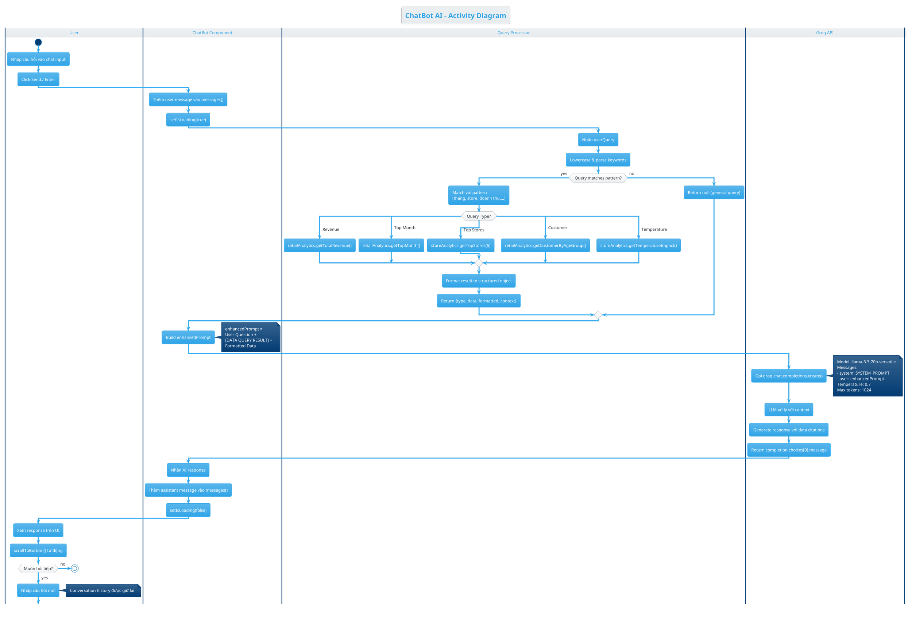

# Tài Liệu Kỹ Thuật: Kiểm Thử & Kiến Trúc Hệ Thống

---

## Mục Lục
1. [Phương Thức Kiểm Tra Dữ Liệu](#1-phương-thức-kiểm-tra-dữ-liệu)
2. [Cấu Trúc Dữ Liệu Web Dashboard](#2-cấu-trúc-dữ-liệu-web-dashboard)
3. [Cơ Chế Hoạt Động ChatBot AI](#3-cơ-chế-hoạt-động-chatbot-ai)
4. [PlantUML Activity Diagram](#4-plantuml-activity-diagram)
5. [LaTeX Source Code](#5-latex-source-code)

---

## 1. Phương Thức Kiểm Tra Dữ Liệu

### 1.1 Tổng Quan

Hệ thống sử dụng **Schema Validation** (không phải Unit Test truyền thống) để đảm bảo tính toàn vẹn của Star Schema trong Data Warehouse. Đây là phương pháp **Data Quality Testing** dành riêng cho Data Pipeline.

### 1.2 Các Loại Kiểm Tra (Test Cases)

| Test Case | Mô Tả | Kỹ Thuật |
|-----------|-------|----------|
| **File Existence** | Kiểm tra file output có tồn tại không | `Path.exists()` |
| **Primary Key Uniqueness** | PK không có duplicates và nulls | `df[pk].duplicated()`, `df[pk].isna()` |
| **Foreign Key Integrity** | FK trong FACT phải tồn tại trong DIM | `fact[fk].isin(dim[pk])` |
| **Referential Integrity** | Không có orphaned records | Count non-matching FK |
| **Schema Completeness** | Tất cả dimensions required phải có mặt | Set comparison |

### 1.3 Chi Tiết Từng Test

#### 1.3.1 Primary Key Validation
```python
def check_primary_key(df: pd.DataFrame, pk: str, table: str) -> bool:
    """
    Kiểm tra Primary Key:
    - pk phải tồn tại trong columns
    - Không có giá trị duplicate
    - Không có giá trị NULL
    """
    dup = df[pk].duplicated().sum()  # Đếm số bản ghi trùng
    nulls = df[pk].isna().sum()      # Đếm số bản ghi NULL
    return dup == 0 and nulls == 0
```

**Ý nghĩa:**
- Đảm bảo mỗi record có identifier duy nhất
- Ngăn chặn data corruption khi JOIN tables
- Tuân thủ quy tắc Star Schema

#### 1.3.2 Foreign Key Validation
```python
def check_foreign_key(fact, dim, fk, pk, fact_name, dim_name) -> bool:
    """
    Kiểm tra Foreign Key:
    - FK trong FACT phải match với PK trong DIM
    - Cho phép NULL (optional relationship)
    - Không cho phép orphaned keys
    """
    non_match = (~fact[fk].dropna().isin(dim[pk])).sum()
    return non_match == 0  # Không có orphaned records
```

**Ý nghĩa:**
- Đảm bảo tính toàn vẹn tham chiếu (Referential Integrity)
- Ngăn JOIN failures với "missing dimension" errors
- Phát hiện data pipeline issues sớm

### 1.4 Bảng Test Cases Đầy Đủ

| ID | Table | Test Type | Column | Expected | Pass Criteria |
|----|-------|-----------|--------|----------|---------------|
| TC01 | DIM_PRODUCT | PK Unique | product_key | 0 duplicates | dup_count = 0 |
| TC02 | DIM_CUSTOMER | PK Unique | customer_key | 0 duplicates | dup_count = 0 |
| TC03 | DIM_DATE | PK Unique | date_key | 0 duplicates | dup_count = 0 |
| TC04 | DIM_PAYMENT | PK Unique | payment_key | 0 duplicates | dup_count = 0 |
| TC05 | DIM_CATEGORY | PK Unique | category_key | 0 duplicates | dup_count = 0 |
| TC06 | FACT_SALES | PK Unique | transaction_id | 0 duplicates | dup_count = 0 |
| TC07 | FACT_SALES | FK Valid | date_key → DIM_DATE | 0 orphans | orphan_count = 0 |
| TC08 | FACT_SALES | FK Valid | customer_key → DIM_CUSTOMER | 0 orphans | orphan_count = 0 |
| TC09 | FACT_SALES | FK Valid | product_key → DIM_PRODUCT | 0 orphans | orphan_count = 0 |
| TC10 | FACT_SALES | FK Valid | payment_key → DIM_PAYMENT | 0 orphans | orphan_count = 0 |
| TC11 | FACT_SALES | FK Valid | category_key → DIM_CATEGORY | 0 orphans | orphan_count = 0 |

### 1.5 Kết Quả Validation

```
================================================================================
START VALIDATION
================================================================================
[OK] DIM_PRODUCT.csv
DIM_PRODUCT: primary key is valid (17287 rows)
[OK] DIM_CUSTOMER.csv
DIM_CUSTOMER: primary key is valid (50000 rows)
[OK] DIM_DATE.csv
DIM_DATE: primary key is valid (365 rows)
[OK] DIM_PAYMENT.csv
DIM_PAYMENT: primary key is valid (4 rows)
[OK] DIM_CATEGORY.csv
DIM_CATEGORY: primary key is valid (4 rows)
[OK] FACT_SALES.csv
FACT_SALES: primary key is valid (50000 rows)
FACT_SALES -> DIM_DATE: date_key valid
FACT_SALES -> DIM_CUSTOMER: customer_key valid
FACT_SALES -> DIM_PRODUCT: product_key valid
FACT_SALES -> DIM_PAYMENT: payment_key valid
FACT_SALES -> DIM_CATEGORY: category_key valid
================================================================================
Validation passed
================================================================================
```

---

## 2. Cấu Trúc Dữ Liệu Web Dashboard

### 2.1 Kiến Trúc Tổng Quan

```
WEB/src/
├── data/                          # Static JSON data layer
│   ├── retail_sales.json          # Star Schema 1: FACT_SALES
│   ├── store_performance.json     # Star Schema 2: FACT_STORE_PERFORMANCE
│   ├── ecommerce.json             # Star Schema 3: FACT_ECOMMERCE
│   └── index.js                   # Data exports
│
├── services/                      # Business logic layer
│   └── dataAnalytics.js           # AI query engine (796 lines)
│
├── components/
│   ├── Dashboards/                # Visualization layer
│   │   ├── RevenueTrendAnalysis.jsx
│   │   ├── CustomerSegmentation.jsx
│   │   └── StoreSalesPerformance.jsx
│   │
│   ├── ChatBot/
│   │   └── ChatBot.jsx            # AI assistant UI
│   │
│   └── Charts/
│       └── ChartAIHelper.jsx      # Per-chart AI popup
│
└── App.jsx                        # Main router
```

### 2.2 Data Flow Architecture

```
┌─────────────────────────────────────────────────────────────────────────────┐
│                           DATA WAREHOUSE (DuckDB)                           │
│  ┌─────────────┐  ┌─────────────┐  ┌─────────────┐  ┌─────────────┐        │
│  │ FACT_SALES  │  │FACT_STORE_  │  │FACT_ECOMM   │  │ DIM_*       │        │
│  │   50,000    │  │PERFORMANCE  │  │   6,435     │  │  Tables     │        │
│  │  records    │  │   6,435     │  │  records    │  │             │        │
│  └──────┬──────┘  └──────┬──────┘  └──────┬──────┘  └─────────────┘        │
│         │                │                │                                 │
└─────────┼────────────────┼────────────────┼─────────────────────────────────┘
          │ Extract        │                │
          ▼                ▼                ▼
┌─────────────────────────────────────────────────────────────────────────────┐
│                        JSON DATA FILES (Static Cache)                       │
│  ┌─────────────────┐  ┌─────────────────┐  ┌─────────────────┐              │
│  │retail_sales.json│  │store_perf.json  │  │ecommerce.json   │              │
│  │ - totalRevenue  │  │ - totalSales    │  │ - totalProducts │              │
│  │ - revenueByMonth│  │ - salesByStore  │  │ - topBrands     │              │
│  │ - customerAge   │  │ - tempImpact    │  │ - priceDistrib  │              │
│  └────────┬────────┘  └────────┬────────┘  └────────┬────────┘              │
│           │                    │                    │                       │
└───────────┼────────────────────┼────────────────────┼───────────────────────┘
            │ Import             │                    │
            ▼                    ▼                    ▼
┌─────────────────────────────────────────────────────────────────────────────┐
│                     dataAnalytics.js (Query Engine)                         │
│  ┌───────────────┐  ┌───────────────┐  ┌───────────────┐                    │
│  │retailAnalytics│  │storeAnalytics │  │ecommerceAnaly │                    │
│  │ getTopMonth() │  │ getTopStores()│  │ getTopBrands()│                    │
│  │ getRevenue()  │  │ getTempImpact │  │ getDiscount() │                    │
│  └───────────────┘  └───────────────┘  └───────────────┘                    │
│                                                                             │
│  ┌─────────────────────────────────────────────────────────────┐            │
│  │ queryProcessor.processQuery(userQuestion)                   │            │
│  │ → Natural Language → Structured Data → Formatted Response   │            │
│  └─────────────────────────────────────────────────────────────┘            │
│                                                                             │
│  ┌─────────────────────────────────────────────────────────────┐            │
│  │ generateDataContext() → Full JSON context for AI prompt     │            │
│  └─────────────────────────────────────────────────────────────┘            │
└─────────────────────────────────────────────────────────────────────────────┘
            │
            │ Consumed by
            ▼
┌─────────────────────────────────────────────────────────────────────────────┐
│                           REACT COMPONENTS                                  │
│                                                                             │
│  ┌─────────────────┐  ┌─────────────────┐  ┌─────────────────┐              │
│  │ Dashboard 1     │  │ Dashboard 2     │  │ Dashboard 3     │              │
│  │ Revenue Trend   │  │ Customer Seg    │  │ Store Perform   │              │
│  │ ┌─────────────┐ │  │ ┌─────────────┐ │  │ ┌─────────────┐ │              │
│  │ │ Recharts    │ │  │ │ Recharts    │ │  │ │ Recharts    │ │              │
│  │ │ LineChart   │ │  │ │ BarChart    │ │  │ │ ComposedChart│              │
│  │ │ BarChart    │ │  │ │ PieChart    │ │  │ │ AreaChart   │ │              │
│  │ └─────────────┘ │  │ └─────────────┘ │  │ └─────────────┘ │              │
│  │ [⭐ AI Helper] │  │ [⭐ AI Helper] │  │ [⭐ AI Helper] │              │
│  └─────────────────┘  └─────────────────┘  └─────────────────┘              │
│                                                                             │
│  ┌──────────────────────────────────────────────────────────────────┐       │
│  │                    ChatBot.jsx (Floating AI)                     │       │
│  │    User Question → queryProcessor → Groq API → Response          │       │
│  └──────────────────────────────────────────────────────────────────┘       │
└─────────────────────────────────────────────────────────────────────────────┘
```

### 2.3 JSON Data Structure

#### retail_sales.json (Star Schema 1)
```json
{
  "totalRevenue": 12774665.23,
  "totalOrders": 50000,
  "avgOrderValue": 255.53,
  "avgRating": 3.49,
  "uniqueCustomers": 50000,
  
  "revenueByMonth": [
    { "month": 1, "monthName": "January", "revenue": 1043567.89, "orders": 4087 },
    { "month": 2, "monthName": "February", "revenue": 999234.56, "orders": 3912 },
    ...
  ],
  
  "customerByAgeGroup": [
    { "ageGroup": "<18", "count": 1162, "percentage": 2.32 },
    { "ageGroup": "18-30", "count": 14023, "percentage": 28.05 },
    { "ageGroup": "31-45", "count": 17528, "percentage": 35.06 },
    { "ageGroup": "46-60", "count": 17287, "percentage": 34.57 }
  ],
  
  "revenueByPayment": [
    { "method": "Cash on Delivery", "revenue": 3234567.89, "percentage": 25.32 },
    { "method": "Credit Card", "revenue": 3156789.12, "percentage": 24.71 },
    ...
  ]
}
```

#### store_performance.json (Star Schema 2)
```json
{
  "totalWeeklySales": 6737218987.11,
  "totalRecords": 6435,
  "totalStores": 45,
  "avgWeeklySales": 1046905.18,
  "avgCPI": 171.58,
  "avgUnemployment": 8.0,
  "avgFuelPrice": 3.36,
  "avgTemperature": 60.66,
  
  "salesByStore": [
    { "store": "Store 20", "totalSales": 301397792.46 },
    { "store": "Store 4", "totalSales": 299543953.00 },
    ...
  ],
  
  "temperatureImpact": [
    { "tempCategory": "Cold", "totalSales": 2442000000, "percentage": 35.85 },
    { "tempCategory": "Warm", "totalSales": 1800000000, "percentage": 26.73 },
    ...
  ],
  
  "economicTrend": [
    { "date": "2010-02-05", "cpi": 211.08, "unemployment": 8.1, "weeklySales": 42500000 },
    ...
  ]
}
```

---

## 3. Cơ Chế Hoạt Động ChatBot AI

### 3.1 Kiến Trúc Tổng Quan

```
┌─────────────────────────────────────────────────────────────────────────────┐
│                           CHATBOT ARCHITECTURE                              │
│                                                                             │
│  ┌─────────────┐                                     ┌─────────────┐        │
│  │   User      │                                     │  Groq API   │        │
│  │  (Browser)  │                                     │(LLM Server) │        │
│  └──────┬──────┘                                     └──────┬──────┘        │
│         │                                                   │               │
│         │ 1. Type question                                  │               │
│         ▼                                                   │               │
│  ┌─────────────────────────────────────────────────────────┐│               │
│  │                    ChatBot.jsx                          ││               │
│  │  ┌───────────────────────────────────────────────────┐  ││               │
│  │  │  State Management                                  │  ││               │
│  │  │  - messages: [{role, content}, ...]                │  ││               │
│  │  │  - input: string                                   │  ││               │
│  │  │  - isLoading: boolean                              │  ││               │
│  │  └───────────────────────────────────────────────────┘  ││               │
│  │                         │                                ││               │
│  │                         │ 2. sendMessage()               ││               │
│  │                         ▼                                ││               │
│  │  ┌───────────────────────────────────────────────────┐  ││               │
│  │  │  queryProcessor.processQuery(userQuery)            │  ││               │
│  │  │  ─────────────────────────────────────────────────│  ││               │
│  │  │  • Parse natural language                          │  ││               │
│  │  │  • Match keywords (tháng, store, doanh thu...)    │  ││               │
│  │  │  • Query local JSON data                           │  ││               │
│  │  │  • Return structured result                        │  ││               │
│  │  └──────────────────────┬────────────────────────────┘  ││               │
│  │                         │ 3. Local data result          ││               │
│  │                         ▼                                ││               │
│  │  ┌───────────────────────────────────────────────────┐  ││               │
│  │  │  Build Enhanced Prompt                             │  ││               │
│  │  │  ─────────────────────────────────────────────────│  ││               │
│  │  │  enhancedPrompt = `                                │  ││               │
│  │  │    User Question: ${userQuery}                     │  ││               │
│  │  │    [DATA QUERY RESULT]                             │  ││               │
│  │  │    Type: ${localResult.type}                       │  ││               │
│  │  │    Data: ${localResult.formatted}                  │  ││               │
│  │  │    Insight: ${localResult.insight}                 │  ││               │
│  │  │  `                                                 │  ││               │
│  │  └──────────────────────┬────────────────────────────┘  ││               │
│  │                         │ 4. API Call                   ││               │
│  │                         ▼                               ▼│               │
│  │  ┌───────────────────────────────────────────────────────┐               │
│  │  │  groq.chat.completions.create({                       │               │
│  │  │    model: "llama-3.3-70b-versatile",                 │               │
│  │  │    messages: [                                        │               │
│  │  │      { role: "system", content: SYSTEM_PROMPT },      │               │
│  │  │      ...conversationHistory,                          │               │
│  │  │      { role: "user", content: enhancedPrompt }        │               │
│  │  │    ],                                                 │               │
│  │  │    temperature: 0.7,                                  │               │
│  │  │    max_tokens: 1024                                   │               │
│  │  │  })                                                   │               │
│  │  └──────────────────────┬────────────────────────────────┘               │
│  │                         │ 5. AI Response                                 │
│  │                         ▼                                                │
│  │  ┌───────────────────────────────────────────────────┐                   │
│  │  │  setMessages([...prev, assistantMessage])          │                   │
│  │  │  → Render response to UI                           │                   │
│  │  └───────────────────────────────────────────────────┘                   │
│  └─────────────────────────────────────────────────────────────────────────┘│
└─────────────────────────────────────────────────────────────────────────────┘
```

### 3.2 SYSTEM_PROMPT - Knowledge Injection

ChatBot được "dạy" kiến thức thông qua một SYSTEM_PROMPT dài chứa:

```javascript
const SYSTEM_PROMPT = `You are Alyss, an intelligent AI analytics assistant...

=== YOUR CAPABILITIES ===
1. Query REAL DATA from warehouse
2. Provide accurate numbers, percentages
3. Explain data correlations
4. Compare metrics across time periods

=== LIVE DATA CONTEXT (Updated Real-time) ===
${generateDataContext()}  // <-- Inject full JSON data here

=== DASHBOARD 1: REVENUE TREND ===
Key Metrics: $12.77M revenue, 50,000 orders...

=== DASHBOARD 2: CUSTOMER SEGMENTATION ===
Age Distribution: 31-45 (35.1%), 46-60 (34.6%)...

=== DASHBOARD 3: STORE PERFORMANCE ===
Total: $6.74B from 45 stores...

=== RESPONSE GUIDELINES ===
1. ALWAYS cite specific numbers
2. Use Vietnamese if user writes Vietnamese
3. Format with bullet points, bold for numbers
4. Max 300 words
`;
```

### 3.3 Query Processing Flow

```
User: "Tháng nào doanh thu cao nhất?"
         │
         ▼
┌─────────────────────────────────────────────────────────┐
│ queryProcessor.processQuery(query)                      │
│ ────────────────────────────────────────────────────── │
│ q = query.toLowerCase()                                 │
│ if (q.includes('tháng') && q.includes('cao nhất')) {   │
│   const topMonth = retailAnalytics.getTopMonth()        │
│   return {                                              │
│     type: 'top_month',                                  │
│     data: topMonth,                                     │
│     formatted: "March: $1.10M (4,087 orders)",         │
│     context: 'Best performing month'                    │
│   }                                                     │
│ }                                                       │
└──────────────────────┬──────────────────────────────────┘
                       │
                       ▼
┌─────────────────────────────────────────────────────────┐
│ Enhanced Prompt to Groq API:                            │
│ ────────────────────────────────────────────────────── │
│ "User Question: Tháng nào doanh thu cao nhất?          │
│  [DATA QUERY RESULT]                                    │
│  Type: top_month                                        │
│  Context: Best performing month                         │
│  Data: March: $1.10M (4,087 orders)                    │
│                                                         │
│  Please provide a helpful response using this data."   │
└──────────────────────┬──────────────────────────────────┘
                       │
                       ▼
┌─────────────────────────────────────────────────────────┐
│ Groq AI Response:                                       │
│ ────────────────────────────────────────────────────── │
│ "📊 **Tháng có doanh thu cao nhất: March (Tháng 3)**   │
│                                                         │
│ Dựa trên data từ Star Schema 1 (FACT_SALES):           │
│ - **Doanh thu**: $1.10M                                 │
│ - **Số đơn hàng**: 4,087 orders                         │
│ - **Cao hơn trung bình**: 12.3%                         │
│                                                         │
│ **Lý do có thể:**                                       │
│ • Mùa xuân - nhu cầu mua sắm tăng                       │
│ • Các chương trình khuyến mãi đầu năm                   │
│                                                         │
│ 💡 Muốn so sánh với tháng thấp nhất không?"            │
└─────────────────────────────────────────────────────────┘
```

### 3.4 Data Analytics Service Methods

| Method | Description | Returns |
|--------|-------------|---------|
| `retailAnalytics.getTopMonth()` | Tháng doanh thu cao nhất | `{month, revenue, orders}` |
| `retailAnalytics.getLowestMonth()` | Tháng doanh thu thấp nhất | `{month, revenue, orders}` |
| `storeAnalytics.getTopStores(n)` | Top N stores | `[{store, totalSales}]` |
| `storeAnalytics.getTemperatureImpact()` | Doanh số theo nhiệt độ | `[{temp, sales, %}]` |
| `crossAnalytics.getAllKPIs()` | Tất cả KPIs 3 schemas | `{retail, store, ecommerce}` |
| `queryProcessor.processQuery()` | Parse NL query → data | `{type, data, formatted}` |
| `generateDataContext()` | Full JSON for AI | `string (JSON)` |

---

## 4. PlantUML Activity Diagram

### 4.1 Chatbot Flow Diagram



### 4.2 Data Flow Diagram

```plantuml
@startuml Data_Flow_Diagram
!theme cerulean

title Data Flow - From DuckDB to ChatBot Response
caption Walmart Analytics Dashboard

rectangle "Data Warehouse" as DW {
  database "DuckDB\nwalmart_analytics.db" as DB
  
  collections "Star Schema 1" as SS1 {
    card "FACT_SALES\n50,000 rows" as F1
    card "DIM_CUSTOMER" as D1
    card "DIM_PRODUCT" as D2
  }
  
  collections "Star Schema 2" as SS2 {
    card "FACT_STORE_PERF\n6,435 rows" as F2
    card "DIM_STORE" as D3
    card "DIM_TEMPERATURE" as D4
  }
  
  collections "Star Schema 3" as SS3 {
    card "FACT_ECOMMERCE\n6,435 rows" as F3
  }
}

rectangle "JSON Data Layer" as JDL {
  file "retail_sales.json" as J1
  file "store_performance.json" as J2
  file "ecommerce.json" as J3
}

rectangle "Analytics Service" as AS {
  component "dataAnalytics.js" as DA {
    card "retailAnalytics" as RA
    card "storeAnalytics" as SA
    card "ecommerceAnalytics" as EA
    card "queryProcessor" as QP
    card "generateDataContext()" as GDC
  }
}

rectangle "UI Components" as UI {
  component "ChatBot.jsx" as CB
  component "ChartAIHelper.jsx" as CAH
  component "Dashboard Components" as DC
}

cloud "Groq API" as GROQ {
  card "llama-3.3-70b-versatile" as LLM
}

' Data flow
DB --> J1 : Extract & Transform
DB --> J2 : Extract & Transform
DB --> J3 : Extract & Transform

J1 --> DA : import
J2 --> DA : import
J3 --> DA : import

DA --> CB : Query Results
DA --> CAH : Chart Context
DA --> DC : Chart Data

CB --> GROQ : API Call\n(SYSTEM_PROMPT + Query)
GROQ --> CB : AI Response

CAH --> GROQ : Chart-specific Query
GROQ --> CAH : Chart Explanation

@enduml
```

### 4.3 Render PlantUML

Để render diagram, sử dụng:
- **Online**: https://www.plantuml.com/plantuml/uml/
- **VS Code Extension**: "PlantUML" by jebbs
- **Command line**: `java -jar plantuml.jar diagram.puml`

---

## 5. LaTeX Source Code

```latex
\section{Kiểm Thử và Kiến Trúc Hệ Thống}

% ============================================================
\subsection{Phương Thức Kiểm Tra Dữ Liệu (Data Validation)}

Hệ thống sử dụng phương pháp \textbf{Schema Validation} để đảm bảo tính toàn vẹn của Star Schema trong Data Warehouse. Khác với Unit Test truyền thống, đây là \textbf{Data Quality Testing} dành riêng cho Data Pipeline.

\subsubsection{Các Loại Test Cases}

\begin{table}[H]
\centering
\caption{Test Cases cho Schema Validation}
\label{tab:testcases}
\begin{tabular}{|c|l|l|l|}
\hline
\textbf{ID} & \textbf{Test Type} & \textbf{Table} & \textbf{Pass Criteria} \\
\hline
TC01-TC06 & Primary Key Uniqueness & DIM\_* \& FACT\_SALES & duplicates = 0, nulls = 0 \\
TC07-TC11 & Foreign Key Integrity & FACT\_SALES → DIM\_* & orphan\_count = 0 \\
\hline
\end{tabular}
\end{table}

\begin{lstlisting}[language=Python, caption=Primary Key Validation]
def check_primary_key(df, pk, table):
    dup = df[pk].duplicated().sum()
    nulls = df[pk].isna().sum()
    return dup == 0 and nulls == 0
\end{lstlisting}

\begin{lstlisting}[language=Python, caption=Foreign Key Validation]
def check_foreign_key(fact, dim, fk, pk):
    non_match = (~fact[fk].dropna().isin(dim[pk])).sum()
    return non_match == 0  # No orphaned records
\end{lstlisting}

% ============================================================
\subsection{Cấu Trúc Dữ Liệu Web Dashboard}

\subsubsection{Kiến Trúc 3 Lớp}

\begin{enumerate}
    \item \textbf{Data Layer}: JSON files (retail\_sales.json, store\_performance.json, ecommerce.json)
    \item \textbf{Service Layer}: dataAnalytics.js (796 dòng) - Query engine cho AI
    \item \textbf{Presentation Layer}: React components với Recharts
\end{enumerate}

\begin{figure}[H]
    \centering
    \includegraphics[width=0.9\textwidth]{images/web_architecture.png}
    \caption{Kiến trúc 3 lớp của Web Dashboard}
    \label{fig:web_arch}
\end{figure}

% ============================================================
\subsection{Cơ Chế Hoạt Động ChatBot AI}

\subsubsection{Luồng Xử Lý}

ChatBot sử dụng \textbf{Groq API} với model \texttt{llama-3.3-70b-versatile} kết hợp \textbf{RAG-like approach}:

\begin{enumerate}
    \item User nhập câu hỏi (VD: "Tháng nào doanh thu cao nhất?")
    \item \texttt{queryProcessor.processQuery()} parse keywords và query local JSON
    \item Kết quả được inject vào prompt: \texttt{enhancedPrompt = question + data}
    \item Gọi Groq API với \texttt{SYSTEM\_PROMPT} (chứa full context) + \texttt{enhancedPrompt}
    \item LLM generate response với data citations
    \item Response hiển thị trên UI
\end{enumerate}

\begin{figure}[H]
    \centering
    \includegraphics[width=0.95\textwidth]{images/chatbot_flow.png}
    \caption{Activity Diagram - ChatBot AI Flow}
    \label{fig:chatbot_flow}
\end{figure}

\subsubsection{Knowledge Injection}

\begin{lstlisting}[language=JavaScript, caption=System Prompt Structure]
const SYSTEM_PROMPT = `You are Alyss, an AI assistant...

=== LIVE DATA CONTEXT ===
${generateDataContext()}  // Full JSON data injected

=== DASHBOARD 1: REVENUE TREND ===
Key Metrics: $12.77M revenue, 50,000 orders...

=== RESPONSE GUIDELINES ===
1. ALWAYS cite specific numbers from data
2. Use Vietnamese if user writes Vietnamese
`;
\end{lstlisting}

\subsubsection{Data Analytics Service}

\begin{table}[H]
\centering
\caption{Các Methods chính trong dataAnalytics.js}
\label{tab:analytics}
\begin{tabular}{|l|l|}
\hline
\textbf{Method} & \textbf{Returns} \\
\hline
\texttt{retailAnalytics.getTopMonth()} & \{month, revenue, orders\} \\
\texttt{storeAnalytics.getTopStores(n)} & [{store, totalSales}] \\
\texttt{queryProcessor.processQuery(q)} & \{type, data, formatted\} \\
\texttt{generateDataContext()} & Full JSON string for AI \\
\hline
\end{tabular}
\end{table}
```

---

## Tóm Tắt

| Thành Phần | Công Nghệ | Mô Tả |
|------------|-----------|-------|
| **Schema Validation** | Python + Pandas | 11 test cases (PK uniqueness + FK integrity) |
| **Data Layer** | JSON files | 3 files từ 3 Star Schemas |
| **Query Engine** | dataAnalytics.js | 796 dòng, NL query processing |
| **ChatBot** | Groq API + React | llama-3.3-70b-versatile model |
| **Knowledge Injection** | SYSTEM_PROMPT | Full JSON context embedded |
